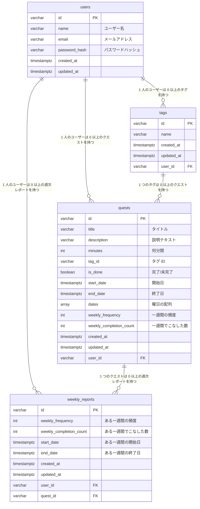

```mermaid

erDiagram
users {
varchar id PK
varchar name "ユーザー名"
varchar email "メールアドレス"
varchar password_hash "パスワードハッシュ"
timestamptz created_at
　　 timestamptz updated_at
}
quests {
varchar id PK
varchar title "タイトル"
varchar description "説明テキスト"
int minutes "何分間"
varchar tag_id "タグ ID"
　　 boolean is_done "完了/未完了"
timestamptz start_date "開始日"
timestamptz end_date "終了日"
array dates 　"曜日の配列"
　　 int weekly_frequency "一週間の頻度"
　　 int weekly_completion_count "一週間でこなした数"
timestamptz created_at
timestamptz updated_at
varchar user_id FK
}
tags {
varchar id PK
varchar name
timestamptz created_at
timestamptz updated_at
varchar user_id FK
}
　 weekly_reports {
varchar id PK
　　 int weekly_frequency "ある一週間の頻度"
　　 int weekly_completion_count "ある一週間でこなした数"
timestamptz start_date "ある一週間の開始日"
timestamptz end_date "ある一週間の終了日"
timestamptz created_at
timestamptz updated_at
varchar user_id FK
varchar quest_id FK
}
users ||--o{ quests : "1 人のユーザーは 0 以上のクエストを持つ"
users || --o{ tags : "1 人のユーザーは 0 以上のタグを持つ"
tags || --o{ quests : "1 つのタグは 0 以上のクエストを持つ"
users ||--o{ weekly_reports : "1 人のユーザーは 0 以上の週次レポートを持つ"
quests ||--o{ weekly_reports : "1 つのクエストは 0 以上の週次レポートを持つ"

```
