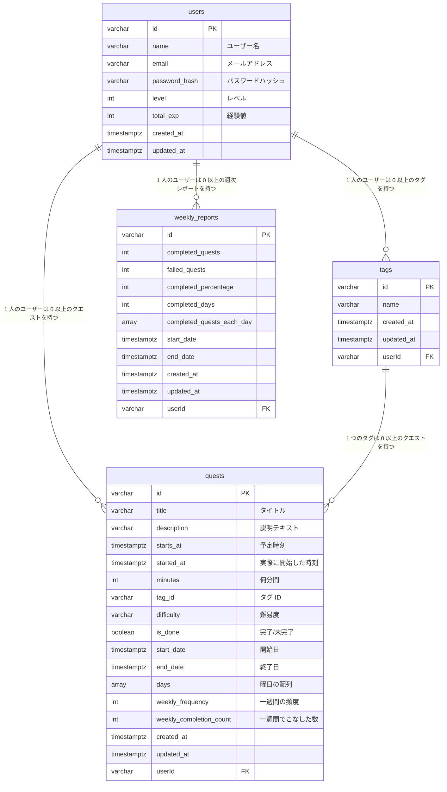

```mermaid
erDiagram
    users {
        varchar id PK
        varchar name "ユーザー名"
        varchar email "メールアドレス"
        varchar password_hash "パスワードハッシュ"
        int level "レベル"
        int total_exp "経験値"
        timestamptz created_at
        timestamptz updated_at
    }
    quests {
        varchar id PK
        varchar title "タイトル"
        varchar description "説明テキスト"
        timestamptz starts_at "予定時刻"
        timestamptz started_at "実際に開始した時刻"
        int minutes "何分間"
        varchar tag_id "タグ ID"
        varchar difficulty "難易度"
        boolean is_done "完了/未完了"
        timestamptz start_date "開始日"
        timestamptz end_date "終了日"
        array days "曜日の配列"
        int weekly_frequency "一週間の頻度"
        int weekly_completion_count "一週間でこなした数"
        timestamptz created_at
        timestamptz updated_at
        varchar userId FK
    }
    tags {
        varchar id PK
        varchar name
        timestamptz created_at
        timestamptz updated_at
        varchar userId FK
    }
    weekly_reports {
        varchar id PK
        int completed_quests
        int failed_quests
        int completed_percentage
        int completed_days
        array completed_quests_each_day
        timestamptz start_date
        timestamptz end_date
        timestamptz created_at
        timestamptz updated_at
        varchar userId FK
    }
    users ||--o{ quests : "1 人のユーザーは 0 以上のクエストを持つ"
    users || --o{ tags : "1 人のユーザーは 0 以上のタグを持つ"
    tags || --o{ quests : "1 つのタグは 0 以上のクエストを持つ"
    users ||--o{ weekly_reports : "1 人のユーザーは 0 以上の週次レポートを持つ"
```
